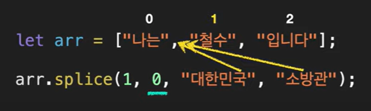
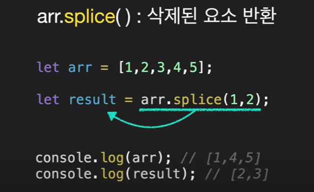
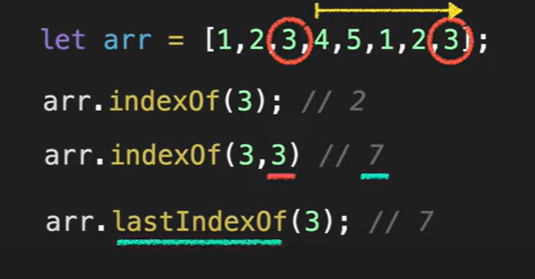

## 기본

- push() : 뒤에 삽입
- pop() : 뒤에 삭제
- unshift() : 앞에 삽입
- shift() : 앞에 삭제

---

### arr.splice(n,m)

- 특정 요소 **지움**
- n : 시작
  **- m : 개수**

```
let arr = [1,2,3,4,5];
arr.splice(1,2);

console.log(arr); //[1,4,5]
```

### arr.splice(n,m,x)

- 특정 요소 지우고 **추가**

```
let arr = [1,2,3,4,5];
arr.splice(1,3,100,200); // [1,100,200,5]
```




---

### arr.slice(n,m)

- **n부터 m까지 반환**
- **m은 포함 X**
- 안 쓰면 배열 끝까지를 의미함

```
let arr = [1,2,3,4,5];
arr.slice(1,4); // [2,3,4]

// 괄호 안에 아무것도 넣지 않은 경우 = 복사
let arr2 = arr.slice();
console.log(arr2); // [1,2,3,4,5]
```

---

### arr.concat(arr1,arr2)

- 합쳐서 새배열 반환

```
let arr = [1,2];
arr.concat([3,4]); // [1,2,3,4]
arr.concat([3,4],[5,6]); // [1,2,3,4,5,6]
arr.concat([3,4],5,6); // [1,2,3,4,5,6]
```

---

### arr.forEach(fn)

- 배열 복사
- 함수를 인수로 받음

```
let arr = ["Mike", "Tom", "Jane"];

arr.forEach((name, index) => {
    console.log(`${index+1}. ${name}`)
})
```

---

### arr.indexOf / arr.lastIndexOf

- lastIndesOf : 뒤에서부터 탐색
  

### arr.includes()

- 포함하는지 확인

```
let arr = [1,2,3];
arr.includes(2); // true
arr.includes(8); // false
```

### arr.find(fn)

- 포함하는지 확인
- 복잡한 연산 가능
- 함수 연동 가능
- **첫 번째 true 값만 반환하고 끝**
- **없으면 undefined를 반환**

```
let arr = [1, 2, 3, 4, 5];
const result = arr.find((item) => {
  return item % 2 === 0;
});

console.log(result); // 2

```

```
let userList = [
  { name: "Mike", age: 30 },
  { name: "Jane", age: 27 },
  { name: "Tom", age: 15 },
];
const result = userList.find((user) => {
  if (user.age < 19) {
    return true;
  }
  return false;
});

console.log(result); // {name: 'Tom', age: 15}
```

### arr.findIndex(fn)

- **인텍스 반환**
- **없으면 -1 반환**

```
let userList = [
  { name: "Mike", age: 30 },
  { name: "Jane", age: 27 },
  { name: "Tom", age: 15 },
];
const result = userList.findIndex((user) => {
  if (user.age < 19) {
    return true;
  }
  return false;
});

console.log(result); // 2
```

### arr.filter(fn)

- 만족하는 모든 요소를 배열로 반환

```
let arr = [1, 2, 3, 4, 5, 6];
const result = arr.filter((item) => {
  return item % 2 === 0;
});

console.log(result); //[2,4,6]
```

---

### arr.reverse()

- 역순으로 제정렬
- 사용 예시 : 최근 가입된 유저, 게시판에서 가장 최근에 작성한 글 순서

```
let arr = [1, 2, 3, 4, 5];
arr.reverse(); // [5,4,3,2,1]
```

---

## arr.map(fn)

- 함수를 받아 특정 기능을 시행하고 새로운 배열을 반환

```
let userList = [
  { name: "Mike", age: 30 },
  { name: "Jane", age: 27 },
  { name: "Tom", age: 15 },
];

let newUserList = userList.map((user, index) => {
  return Object.assign({}, user, {
    id: index + 1,
    isAdult: user.age > 19,
  });
});

console.log(newUserList);
console.log(userList);
```

---

### join()

- 배열을 합쳐서 문자열을 만들어내는 것
- 인자로 전달하는 것 = 구분자
  - 입력 X => 구분자 = **,**

```
let arr = ["Hello", "my", "name", "is", "hyojoo"];
let result = arr.join();
console.log(result); // Hello,my,name,is,hyojoo
```

```
let arr = ["Hello", "my", "name", "is", "hyojoo"];
let result = arr.join("_");
console.log(result); // Hello_my_name_is_hyojoo
```

### split

- 문자열로 나워서 배열로 만들어줌
- 인자를 기준으로 나눔

```
const users = "Mike, Jamem, Tom, Tony";
const result = users.split(",");
console.log(result); // ['Mike', ' Jamem', ' Tom', ' Tony']

const str = "Hello my name is hyojoo";
const result2 = str.split("");
console.log(result2); // ['H', 'e', 'l', 'l', 'o', ' ', 'm', 'y', ' ', 'n', 'a', 'm', 'e', ' ', 'i', 's', ' ', 'h', 'y', 'o', 'j', 'o', 'o']
```

---

### Array.isArray()

- 배열인지 확인하는 것

```
let user = {
  name: "Mike",
  age: 30,
};

let userList = ["Mike", "Tom", "Jane"];

console.log(typeof user); // object
console.log(typeof userList); //object

console.log(Array.isArray(user)); // false
console.log(Array.isArray(userList)); // true
```
