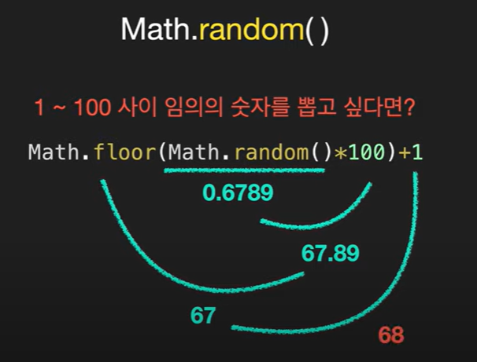
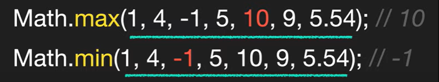
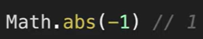

## toString

-   **숫자 -> 문자**
-   **10진수 -> 2진수/16진수**

```
let num = 10;

num.toString(); // "10"
num.toString(2); // "1010"

let num2 = 225;
num2.toString(16); //"ff"

```

---

## Math

ex)

-   Math.PI
-   Math.ceil() : 올림
-   Math.floor() : 내림
-   Math.round() : 반올림

```
let num1 = 5.1;
let num2 = 5.7

Math.ceil(num1); // 6
Math.ceil(num2); // 6

Math.floor(num1); //5
Math.floor(num2); //5

Math.round(num1); //5
Math.round(num2); //6

```

-   toFixed() : 소수점 자릿수
    -   **문자열로 반환함**
        => **number()**을 이용해 **숫자로 변환하는 작업**을 해야함

```
let userRate = 30.1234;

//문자열 반환
userRate.toFixed(2); // "30.12"
userRate.toFixed(0); // "30"
userRate.toFixed(6); // "30.123400"

// 숫자로 변환
Number(userRate.toFixed(2)) // 30.12
```

---

## isNaN

-   **숫자인지 판단하는 것**

```
let x = Number('x');

x == NaN; // false
x === NaN; // false
NaN == NaN; // false

isNaN(x) //true
isNaN(3) // false
```

---

## parseInt()

-   **문자열을** **숫자로** 바꿔줌
-   number()와 다른 점 : 문자가 혼용되어 있어도 동작함

```
let margin = "10px";

parseInt(margin); //10
Number(margin); // NaN
```

-   문자를 만나면 숫자를 반환함
    = **숫자로 시작하지 않으면 NaN 반환**

```
let redColor = "f3";
parseInt(redColor); // NaN
```

-   **두 번째 인수**를 받아서 **진수를** 정할 수 있음

```
let redColor = "f3";
parseInt(redColor, 16); // 234

parseInt("11", 2); //3
```

---

## parseFloat()

-   **부동 소수점** 반환
-   perseInt : 소수점 이하는 무시하고 반환

```
let padding = "18.5%";

parseInt(padding); // 18
parseFloat(padding); // 18.5
```

---

## Matn.random()

-   0 ~ 1 사이무작위 숫자 생성
-   원하는 범위에서 무작위 숫자 생성하기
-   0이 나올 수 도 있기 때문에 **1을 더함**
    

---

## Math.max(), Math.min()

-   괄호 안 인수들 중 **최대값**, **최소값**
    

---

## Math.abs()

-   **절대값**
    

---

## Math.pow(n,m)

-   **n의 m제곱**
    

---

## Math.sqrt()

-   **제곱근**
    
