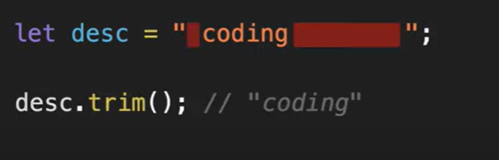
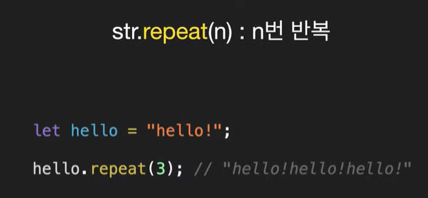

## ` 
- 여러줄 가능함 
---
## " & '
- 여러줄 : \n 
---
### length
- 문자열 길이
```
let a = '안녕하세요.';
a.length; // 6
```
---
### 배열과 같은 점 : 특정 위에 접근
```
let a = '안녕하세요.';
a[2]; // '하'
```
### 다른 점 : 한글자만 바꾸기 불가능
```
let a = '안녕하세요.';
a[4]='용';
console.log(a); // '안녕하세요.'
```
---
### toUpperCase() / toLowerCase() 
- 대문자 / 소문자로 전부 바꾸기
- 영어 경우만 해당
```
let a = "hello, Nice to meet you.";

a.toUpperCase(); // "HELLO, NICE TO MEET YOU."

a.toLowerCase(); // "hello, nuce to meet you."
```
---
### str.indexOf(text)
- 문자를 인수로 받아 몇 번째 위치하는지 알려줌
- 0부터 시작
- **포함된 문자가 여러개라도 첫번째 위차만 반환됨**
- 찾는 문자가 **없**으면 **-1** 반환
```
let a = "hello, Nice to meet you.";
a.indexOf('to'); // 12
a.indexOf('man'); // -1
```
- if문 : 주의해야함
```
let a = "hello, Nice to meet you.";

// hello = 0 -> false -> 따라서 실행 안 됨
// a.indexOf('hello') -> a.indexOf('hello') > -1 
if(a.indexOf('hello')){
    console.log('hello가 포함된 문자입니다.');
}
```
---
### str.slice(n,m)
- n : 시작점
- m 
    - 없으면 문자열 끝까지
    - 양수면 그 숫자까지 **(포함 X)**
    - 음수면 끝에서부터 세서 거기까지 
```
let a = "qwertyu";
a.slice(2); // "ertyu"
a.slice(0,5); // "qwert"
a.slice(2, -2); // "ert"
```
### str.substring(n,m)
- n**과 m사이 문자열 반환**
- n과 m을 바꿔도 동작함
- 음수는 0으로 인식
```
let a = "qwertyu";
a.substring(2,5); // "ert"
a.substring(5,2); // "ert"
```
### str.substr(n.m)
- n : 시작점
- m : 갯수
```
let a = "qwertyu";
a.substr(2,4); // "erty"
a.substr(-4,2); // "rt"
```
### str.trim()
- **앞 뒤 공백 제거**

---

---
### 예제
- **length, push, slice(m,m)**
    ```
    let list = [
        "01. 들어가며",
        "02. JS의 역사",
        "03. 자료형",
        "04. 함수",
        "05. 배열",
    ];

    let newList = [];

    for(let i =0; i<list.length; i++){
        newList.push(list[i].slice(4));
    }

    console.log(newList);
    ```
- **indexOf()**
    ```
    // 금칙어 : 콜라

    function hasCola(str){
        if(str.indexOf('콜라')>-1){
            console.log('금칙어가 있습니다.');
        } else{
            console.log('통과');
        }
    }

    hasCola("사이다 먹고싶다."); // -1
    hasCola("난 콜라 먹고싶다.");
    hasCola("콜라"); // 0

    ```
- **includes()**
    ```
    // 금칙어 : 콜라
    // includes
    // 문자가 있으면 true
    // 없으면 flase 반환

    function hasCola(str){
        if(str.includes('콜라')){
            console.log('금칙어가 있습니다.');
        } else{
            console.log('통과');
        }
    }

    hasCola("사이다 먹고싶다."); // -1
    hasCola("난 콜라 먹고싶다.");
    hasCola("콜라"); // 0
    ```