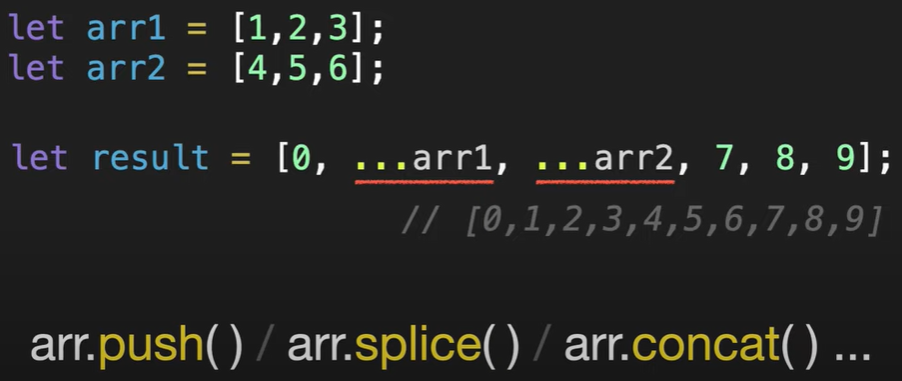
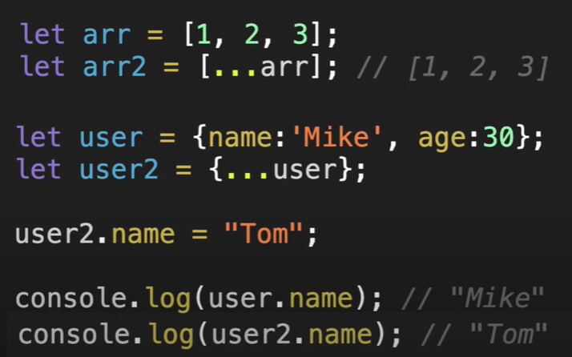

## 전개 구문(Spread syntax)

---

### 배열

## 

---

### 복제



---

#### 예제1 - 두 배열 합치기

- 사용 X

```
let arr1 = [1, 2, 3];
let arr2 = [4, 5, 6];

// reverse : 역순 정렬
// .unshift() : 배열의 맨 앞에 값을 추가
// .push() : 배열의 맨 끝에 값을 추가
// .pop() : 배열의 맨 끝에 값을 제거
// .shift() : 배열의 맨 앞에 값을 제거

arr2.reverse().forEach((num) => {
  arr1.unshift(num);
});

console.log(arr1) //  [4, 5, 6, 1, 2, 3]
```

- 사용 O

```
let arr1 = [1, 2, 3];
let arr2 = [4, 5, 6];

arr1 = [...arr2, ...arr1];

console.log(arr1); //  [4, 5, 6, 1, 2, 3]
```

#### 예제2 - 한 배열로 요소 넣기

- 사용 X

```
let user = { name: "Mike" };
let info = { age: 30 };
let fe = ["JS", "React"];
let lang = ["Korean", "English"];

user = Object.assign({}, user, info, {
  skills: [],
});

fe.forEach((item) => {
  user.skills.push(item);
});
lang.forEach((item) => {
  user.skills.push(item);
});

console.log(user);
```

- 사용 O

```
let user = { name: "Mike" };
let info = { age: 30 };
let fe = ["JS", "React"];
let lang = ["Korean", "English"];

user = {
  ...user,
  ...info,
  skolls: [...fe, ...lang],
};

console.log(user);
```
