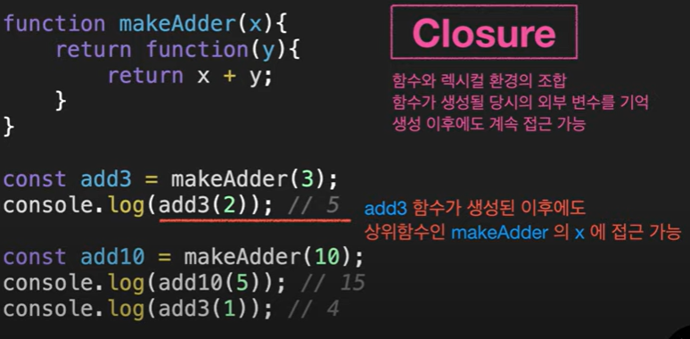

### 어휘적 환경(Lesical Environment)

- 변수 : 선언과 동시에 초기화 X
- 함수 : 선언과 동시에 초기화 O => 바로 사용 가능
  
  
  
  
  
  one은 내부에 없어서 외부로 넓힘
  

---

### closer




---

### 예제

```
function makeCounter() {
  let num = 0; //은닉화

  return function () {
    return num++;
  };
}

let counter = makeCounter();

console.log(counter()); //0
console.log(counter()); //1
console.log(counter()); //2

```
