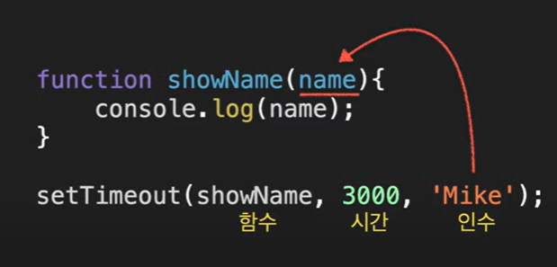
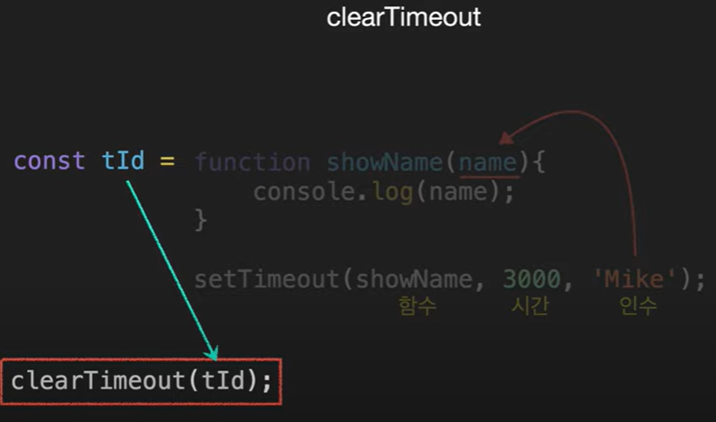
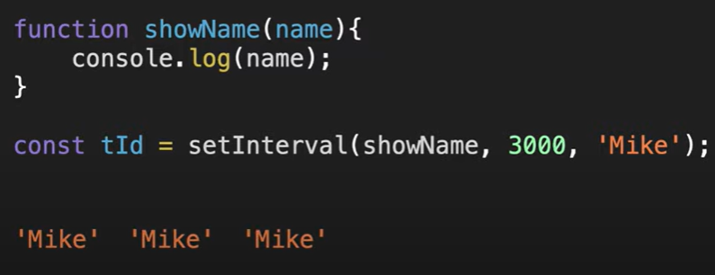
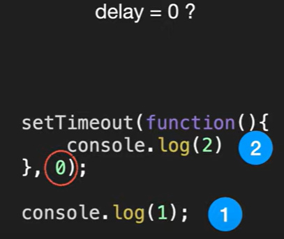

# setTimeOut

- 일정 시간이 지난 후 함수를 실행
- 사용 : setTimeOut(실행할 함수, 시간);
  
  

---

# clearTimeout

- 예정된 작업을 삭제
  

---

## setInterval

- 일정 시간 간격으로 함수를 반복
  

---

#### 주의할 점

- 0이라고 적어도 바로 실행 되지 않음
  = 현재 실행중인 스크립트가 종료된 이후 스케줄링 함수를 실행하기 때문
- 브라우저는 기본적으로 4ms대기 시간이 있음
  

---

### 예제

```
let num = 0;
function showTime() {
  console.log(`${num++}초`);
  if (num > 5) {
    clearInterval(tId); // 5초 뒤부터 실행 안 됨
  }
}

const tId = setInterval(showTime, 1000); // 1초에 한 번씩 계속 실행
```
