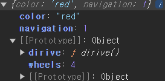
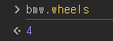
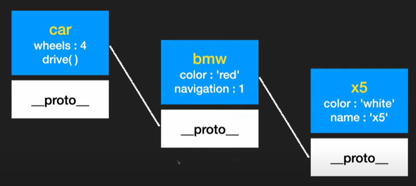
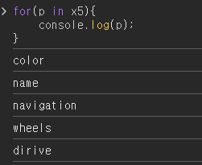
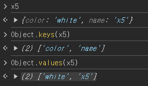
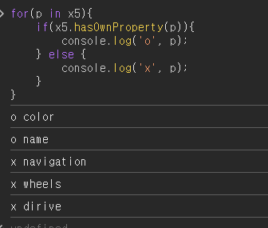
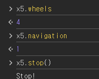
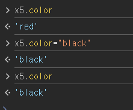
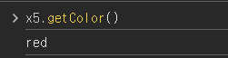

## Prototype

---

### 예문 1

```
const car = {
    wheels: 4,
    dirive() {
        console.log("drive...");
    },
};

const bmw = {
    color: "red",
    navigation: 1,
};

const benz = {
    color: "black",
};

const audi = {
    color: "blue",
};

// car가 bmw의 프로토타입이 됨
// bmw은 car에 상속을 받음
bmw.__proto__ = car;
benz.__proto__ = car;
audi.__proto__ = car;

bmw.__proto__ = car;

const x5 = {
    color: "white",
    name: "x5",
};

x5.__proto__ = bmw;
```

- 객체 내부에서 특정 프로토 타입을 찾음
  - 있으면 => 거기서 탐색을 멈춤
  - 없으면 => **proto** 타입에서 확인

### [아래 사진 참고]



- 내부에 프로토 타입이 없는 경우
  
- 프로토 타입 체인
  
  
- key, values에 대한 값은 상속된 값들은 안 나옴
  
- for에서 상속 값인지 알려면 ?
  

---

## 예문 2

```
const car = {
    wheels: 4,
    dirive() {
        console.log("drive...");
    },
};

const Bmw = function (color) {
    this.color = color;
};

const x5 = new Bmw("red");
const z4 = new Bmw("blue");

x5.__proto__ = car;
z4.__proto__ = car;
```

- 위에 코드와 같은 기능 + 요소 추가
- 생성자 함수가 생성하는 객체에 \_\_proto\_\_ 프로토를 설정한다는 의미

```
// 코드
const Bmw = function (color) {
  this.color = color;
};

Bmw.prototype.wheels = 4;

Bmw.prototype.drive = function () {
  console.log("drive..");
};

Bmw.prototype.navigation = 1;

Bmw.prototype.stop = function () {
  console.log("Stop!");
};

const x5 = new Bmw("red");
const z4 = new Bmw("blue");
```

- 결과
  
  > **중복 코드를 줄일 수 있음**

---

- 아무나 수정 가능해져버림

```
const Bmw = function (color) {
  this.color = color;
};

const x5 = new Bmw("red");
```



- 수정 코드

```
const Bmw = function (color) {
  const c = color;
  this.getColor = function () {
    console.log(c);
  };
};

const x5 = new Bmw("red");
```


