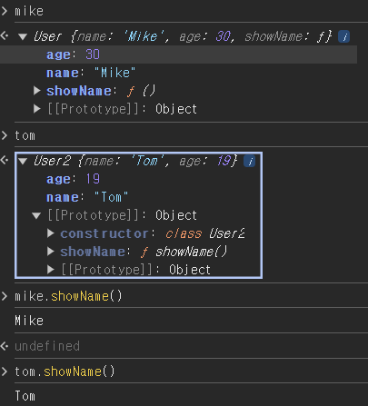
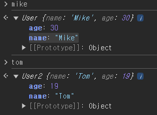
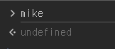
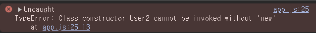
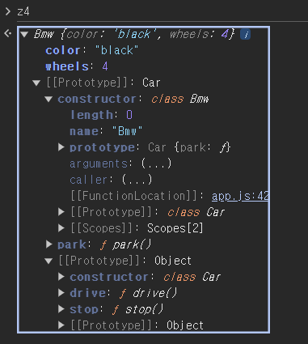
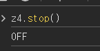
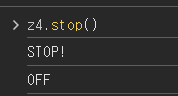
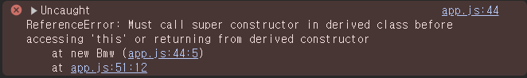
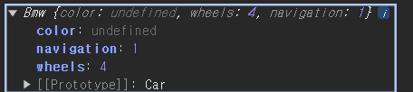

## Class

- ES6에 추가된 스펙

---

#### 비교

1. **생성자 함수를 사용한 코드**

```
const User = function (name, age) {
  this.name = name;
  this.age = age;
  this.showName = function () {
    console.log(this.name);
  };
};

const Mike = new User("Mike", 30);

```

2. **class를 사용한 코드**

- constructor()

  - 객체를 만들어주는 생성자 함수

- 클래스 내에 정의한 메소드는 프로토 타입이 됨 (ex. **showName()**)

```
class user2 {
  constructor(name, age) {
    this.name = name;
    this.age = age;
  }
  showName() {
    console.log(this.name);
  }
}

const tom = new User("Tom", 19);
```

 3. **기존 코드를 클래스 사용 코드와 동일하게 동작하는 코드**

```
const User = function (name, age) {
  this.name = name;
  this.age = age;
  // this.showName = function () {
  //   console.log(this.name);
  // };
};

User.prototype.showName = function () {
  console.log(this.name);
};
```



---

### 단순히 문법의 편리성을 위해 클래스 탄생?

- class는 new 없이 실행 할 수 없다

```
const User = function (name, age) {
  this.name = name;
  this.age = age;
  this.showName = function () {
    console.log(this.name);
  };
};
// new 삭제 => 에러 발생 X
const mike = User("Mike", 30);
```



```
class User2 {
  constructor(name, age) {
    this.name = name;
    this.age = age;
  }
  showName() {
    console.log(this.name);
  }
}

// new 삭제 => 에러 발생 O
const tom = User2("Tom", 19);
```

## 

---

## 상속

- 생성자 함수
  - 프로토 타입을 이용해 구현
- **class**
  - **extends**
    > car를 상속해서 bmw를 만듦

```
class Car {
  constructor(color) {
    this.color = color;
    this.wheels = 4;
  }
  drive() {
    console.log("drive...");
  }
  stop() {
    console.log("STOP!");
  }
}

class Bmw extends Car {
  park() {
    console.log("PARK");
  }
}

const z4 = new Bmw("black");

```



---

## 메소드 오버라이딩

- 동일한 이름을 가진 메소드가 있으면 **덮어씀**

```
class Car {
  constructor(color) {
    this.color = color;
  }
  stop() {
    console.log("STOP!");
  }
}

class Bmw extends Car {
  park() {
    console.log("PARK");
  }
  // 같은 이름 메소드
  stop() {
    console.log("OFF");
  }
}

const z4 = new Bmw("black");
```



#### **부모의 메소드를 그대로 확장하여 사용하고 싶다면??**

- **super.function()**

```
class Car {
  constructor(color) {
    this.color = color;
  }
  stop() {
    console.log("STOP!");
  }
}

class Bmw extends Car {
  park() {
    console.log("PARK");
  }
  stop() {
    super.stop();
    console.log("OFF");
  }
}

const z4 = new Bmw("black");
```



- **부모 생성자를 반드시 먼저 호출해야함**
  - class의 constructor은 빈 객체로 만들어주고 this로 객체를 가르킴
  - extend를 써서 만든 자식 클래스는 빈객체가 만들어지고 this에 할당하는 작업을 건너뜀
- 호출 전 코드

```
class Car {
  constructor(color) {
    this.color = color;
    this.wheels = 4;
  }
  drive() {
    console.log("drive...");
  }
  stop() {
    console.log("STOP!");
  }
}

class Bmw extends Car {
  constructor() {
    this.navigation = 1;
  }
  park() {
    console.log("PARK");
  }
}

const z4 = new Bmw("black");
```

- console
  

- 변경 코드

  ```
  class Car {
    constructor(color) {
      this.color = color;
      this.wheels = 4;
    }
    drive() {
      console.log("drive...");
    }
    stop() {
      console.log("STOP!");
    }
  }

  class Bmw extends Car {
    constructor() {
      // super 추가
      super();
      this.navigation = 1;
    }
    park() {
      console.log("PARK");
    }
  }

  const z4 = new Bmw("black");
  ```

  - navigation은 잘들어갔으나 **color는 undefined**가 됨
    
    => **자식 클래스의 construct에 동일한 인수를 받는 작업을 해야함**

    - 수정코드

    ```
    class Car {
      constructor(color) {
        this.color = color;
        this.wheels = 4;
      }
      drive() {
        console.log("drive...");
      }
      stop() {
        console.log("STOP!");
      }
    }

    class Bmw extends Car {
      // 부모와 동일한 인수를 받음
      constructor(color) {
        super(color);
        this.navigation = 1;
      }
      park() {
        console.log("PARK");
      }
    }

    const z4 = new Bmw("black");
    ```

    - console
      
