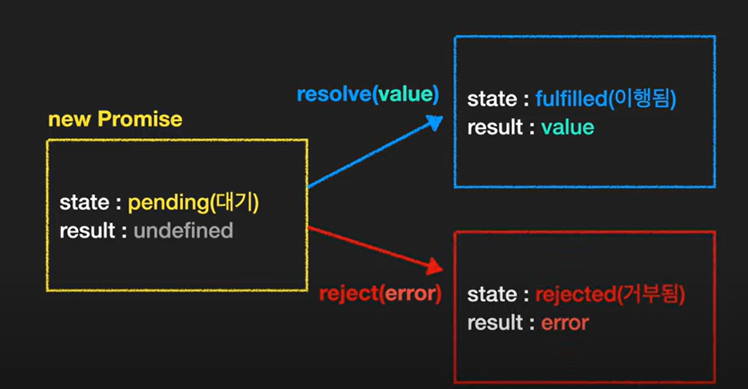
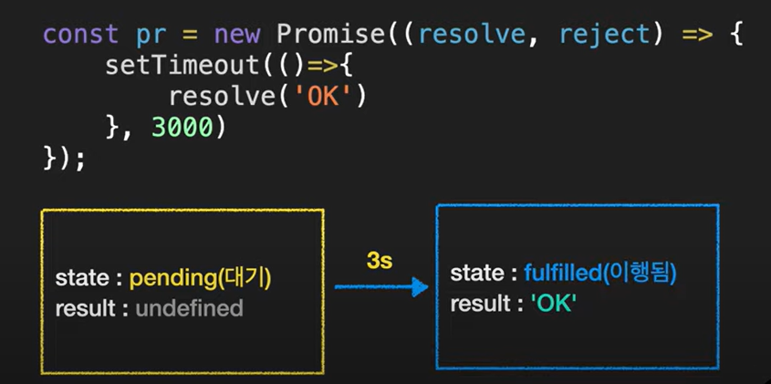
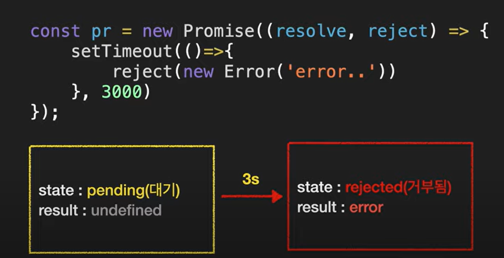
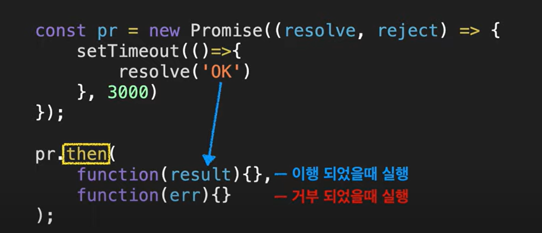
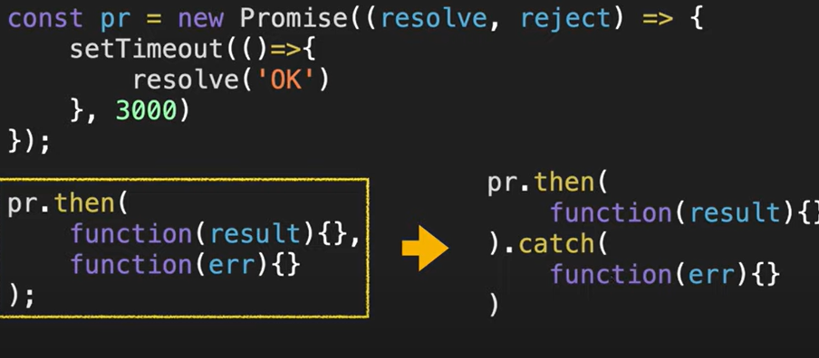
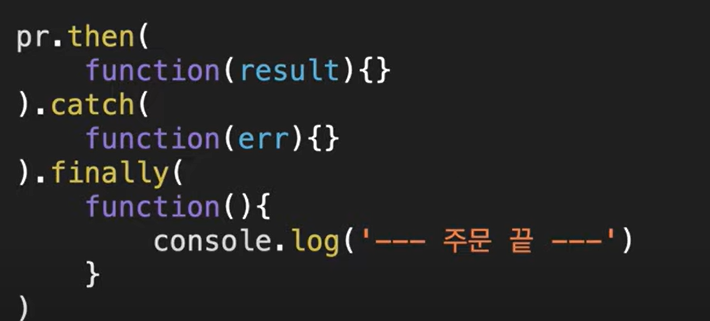
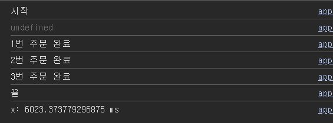
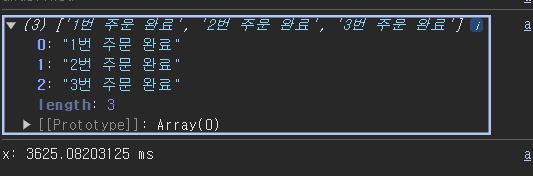

## Pormise

- 상황
  - 상점에 가서 물건을 주문하는 데 그 물건이 나올 때까지 시간이 걸린다고 가정
- 조건
  - 완료 시간 모름
  - 가끔 물건을 만들다가 실패를 하는 경우도 있음
- 소비자 행동
  - 10초에 한번 씩 물어보기
- 참고 자료
  - 노랑 : 완료 유무 질문
  - 빨강 : 완료 X
  - 파랑 : 완료 O
    
  - 실패 경우 => 물건을 다시 주문
    
    - 이 경우 상품 준비, 완료, 실패 상황에 대한 정보 제공을 요구하기 위해 전화 번호를 주고 나옴
      
    - 상점은 번호를 기억했다가 작업이 완료, 실패했을 때 소비자에게 알려줌
      

---

## callback

- **어떤 일이 완료된 이후 실행되는 함수**
  

---



### 판매자의 코드

- 성공을 가정한 코드
  
- 실패를 가정한 코드
  

### 소비자의 코드

- then 사용
  
- 이외에 사용할 수 있는 것
  - catch
    - 높은 가독성
    - 첫번째 함수에서 발생한 에로도 잡아줌
      => catch 문을 사용하는 것이 좋다
      
  - finally
    - 이행이든 거부든 처리가 완료되면 항상 실행
    - 로딩화면 같은 걸 없앨 때 유용함
      

---

### 예문 1

```
const pr = new Promise((resolve, reject) => {
  setTimeout(() => {
    // resolve("OK");
    reject(new Error("error...."));
  }, 1000);
});

console.log("시작");
pr.then((result) => {
  console.log(result);
})
  .catch((err) => {
    console.log(err);
  })
  .finally(() => {
    console.log("끝");
  });
```

---

### 예문 2

- callback() 사용

```
const f1 = (callback) => {
  setTimeout(function () {
    console.log("1번 주문 완료");
    callback();
  }, 1000);
};

const f2 = (callback) => {
  setTimeout(function () {
    console.log("2번 주문 완료");
    callback();
  }, 1000);
};

const f3 = (callback) => {
  setTimeout(function () {
    console.log("3번 주문 완료");
    callback();
  }, 1000);
};

console.log("시작");

f1(function () {
  f2(function () {
    f3(function () {
      console.log("끝");
    });
  });
});

```

- promise 사용

```
const f1 = (message) => {
  console.log(message);
  return new Promise((res, rej) => {
    setTimeout(() => {
      res("1번 주문 완료");
    }, 1000);
  });
};

const f2 = (message) => {
  console.log(message);
  return new Promise((res, rej) => {
    setTimeout(() => {
      res("2번 주문 완료");
    }, 3000);
  });
};

const f3 = (message) => {
  console.log(message);
  return new Promise((res, rej) => {
    setTimeout(() => {
      res("3번 주문 완료");
    }, 2000);
  });
};

// promise chaining

console.log("시작");
console.time("x");
f1()
  .then((res) => f2(res))
  .then((res) => f3(res))
  .then((res) => console.log(res))
  .catch(console.log)
  .finally(() => {
    console.log("끝");
    console.timeEnd("x");
  });

```



---

### Promise.all

- **시간을 줄일** 방법이 없을까?
  - 세 사람이 각 상점에가서 동시에 주문하면 제일 오래 걸리는 3초면 모든 주문 받기 가능
- 배열로 받음
- **한꺼번에 시작하고 모두 이행되면 값을 사용할 수 있음**
- 하나의 정보라도 누락됐을 때 페이지를 보여주면 안 되는 경우에 사용됨
  - **다 보여주거나 안 보여주는 경우**

```
const f1 = (message) => {
  console.log(message);
  return new Promise((res, rej) => {
    setTimeout(() => {
      res("1번 주문 완료");
    }, 1000);
  });
};

const f2 = (message) => {
  console.log(message);
  return new Promise((res, rej) => {
    setTimeout(() => {
      res("2번 주문 완료");
    }, 3000);
  });
};

const f3 = (message) => {
  console.log(message);
  return new Promise((res, rej) => {
    setTimeout(() => {
      res("3번 주문 완료");
    }, 2000);
  });
};

// promise.all()
console.time("x");
Promise.all([f1(), f2(), f3()]).then((res) => {
  console.log(res);
  console.timeEnd("x");
});
```

## 

---

### promise.race

- **하나라도 일등으로 완료되면 끝냄**
- **용량이 큰** 이미지들을 로딩하는데 그중에 하나라도 완료되면 그 이미지를 보여줄 때 사용 됨

```
const f1 = (message) => {
  console.log(message);
  return new Promise((res, rej) => {
    setTimeout(() => {
      res("1번 주문 완료");
    }, 1000);
  });
};

const f2 = (message) => {
  console.log(message);
  return new Promise((res, rej) => {
    setTimeout(() => {
      res("2번 주문 완료");
    }, 3000);
  });
};

const f3 = (message) => {
  console.log(message);
  return new Promise((res, rej) => {
    setTimeout(() => {
      res("3번 주문 완료");
    }, 2000);
  });
};

console.time("x");
Promise.race([f1(), f2(), f3()]).then((res) => {
  console.log(res);
  console.timeEnd("x");
});
```


