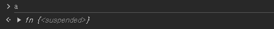
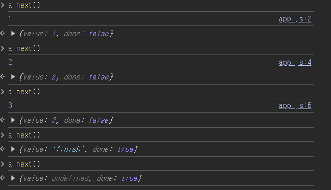
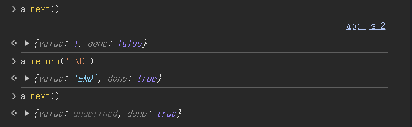
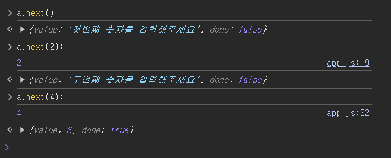
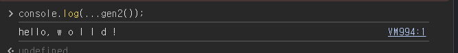

### Generator 1

- 함수의 실행을 중간에 **멈췄다가** **제기할** 수 있는 기능
- 사용
  - **function**
  - **yield**
    - **함수의 실행을 멈춤**
- Generator function을 실행시키면 Generator 객체가 반환
- Generator 객체 : **next 메소드가** 있음

#### 다른 작업을 하다가 다시 돌아와서 next() 해주면 진행이 멈췄던 부분 부터 이어서 실행

---

## Generator 2

- **generator = iterable이면서 iterator**
- **iterable**
  - Symbol.iterator 메서드가 있다
  - Symbol.iterator 는 iterator를 반환해야 한다
  - 배열과 문자열도 interable
- **iterator**
  - next 메서드를 가진다
  - next 메서드는 value와 done 속성을 가진 객체를 반환한다
  - 작업이 끙나면 done은 true가 된다

---

### 예문

- 코드

```
function* fn() {
  try {
    console.log(1);
    yield 1;
    console.log(2);
    yield 2;
    console.log(3);
    yield 3;
    return "finish";
  } catch (e) {
    console.log(e);
  }
}

const a = fn();

```

- generator 객체만 반환되고 함수 본문 코드는 실행 X
  
- **가장 가까운 yeild문을 만날 때까지 실행 -> 데이터 객체 반환**
- **value**
  - **yeild 오른쪽 값**
  - 없으면 undefind
- **done**
  - **함수 코드가 끝났는지**를 나타냄
  - 끝났으면 true
  - 끝나지 않았으면 false
    

---

### next(), return(), throw()

## return()

- 즉시 전 속성 값이 들어감
- 사용 이후 next의 value은 못 얻지만 done은 true가 됨
  

---

### nest()에 인수 전달

- generator은 외부로부터 값을 입력받을 수 있음
- 코드

```
function* fn() {
  const num1 = yield "첫번째 숫자를 입력해주세요";
  console.log(num1);

  const num2 = yield "두번째 숫자를 입력해주세요";
  console.log(num2);

  return num1 + num2;
}

const a = fn();
```



---

### 값을 미리 만들어 놓지 않는다

- while문, 무한 반복을 사용해도 브라우저가 꺼지지 않음
- 필요한 순간까지 계산을 미룸
- generator를 사용하지 않고 아래 코드와 같이 작성하면 안 됨

```
function* fn() {
  let index = 0;
  while (true) {
    yield index++;
  }
}

const a = fn();
```

---

### yield\* 이용

```
function* gen1() {
  yield "w";
  yield "o";
  yield "l";
  yield "l";
  yield "d";
}
function* gen2() {
  yield "hello,";
  // 다른 generator를 호출하고 있음
  yield* gen1();
  yield "!";
}

```


