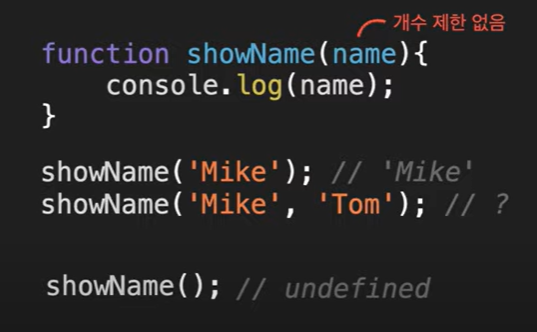
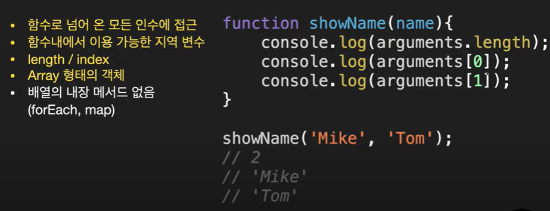
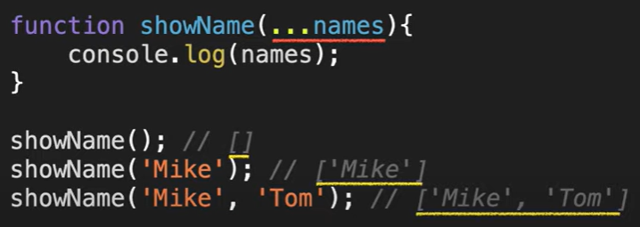

## 인수 전달

- js에서 함수에 넘겨주는 인수에는 제한없다
- 인수의 개수를 정해 놓고 함수로 만들어도 실제 호출할 때 정확히 그 갯수로 맞출 필요 없음
- 아무것도 전달하지 않아도 됨
  

---

## arguments

## 

## 나머지 매개변수 (Rest parameters)

- es6 사용시 이 방법을 권장함
- 인수가 없을 때 : undefined X, 빈 배열 O
  

---

### 예제

```
function add(...numbers) {
  let result = 0;
  numbers.forEach((num) => (result += num));
  console.log(result);
}

add(1, 2, 3); //6
add(1, 2, 3, 4, 5, 6, 7, 8, 9, 10); //55

function add2(...numbers) {
  let result = numbers.reduce((prev, cur) => (prev += cur));
  console.log(result);
}

add2(1, 2, 3); //6
add2(1, 2, 3, 4, 5, 6, 7, 8, 9, 10); //55
```

- 마지막 매개변수는 항상 마지막에 있어야함

```
function User(name, age, ...skills) {
  this.name = name;
  this.age = age;
  this.skills = skills;
}

const user1 = new User("Mike", 30, "html", "css");
const user2 = new User("Jame", 17, "js", "React");
const user3 = new User("Ama", 23, "English");

console.log(user1);
console.log(user2);
console.log(user3);
```
